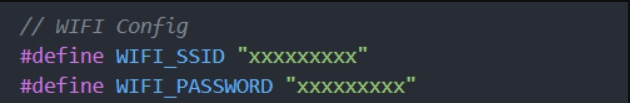
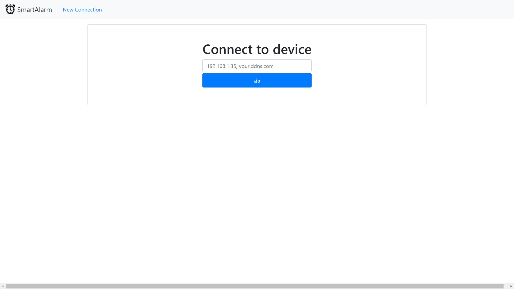
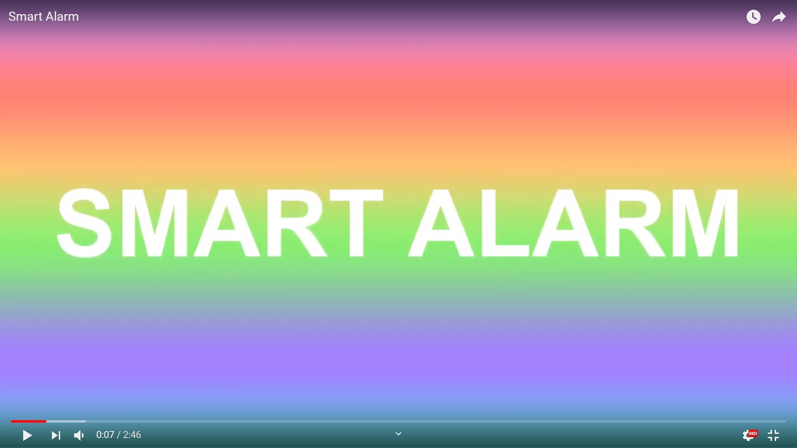
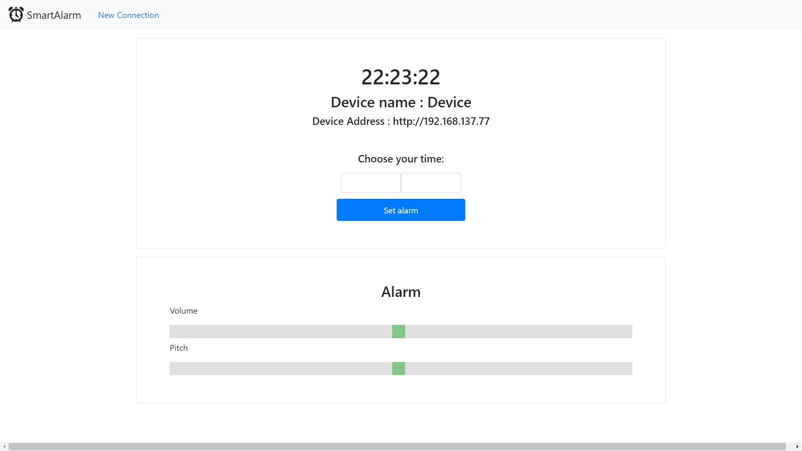

This repository consists of codes of "Computer Programming (Com-Pro)" Project, Faculty of Information Technology, King Mongkut's Institute of Technology Ladkrabang (KMITL).
_____
# Abstract
&nbsp;&nbsp;&nbsp;&nbsp;&nbsp;&nbsp;&nbsp;คุณเคยประสบพบเจอกับปัญหานอนตื่นสายไช่หรือไม่เราขอเสนอนี้ สิ่งที่จะช่วยไห้คุณตื่นนอนได้ตรงเวลา เนื่องจากปัจจุบันคนส่วนใหญ่ที่เรียนในมหาวิทยาลัยไม่สามารถตื่นไปเรียนตรงเวลาได้โดยกลุ่มของเราได้เล็งเห็นถึงปัญหาหลายอย่างที่เกิดขึ้นกับเพื่อนในกลุ่มของเราตื่นสายทุกวันเข้าเรียนสายผู้จัดทำโครงงานได้สอบถามปัญหาในจุดนี้และมาคิดแก้ปัญหาโดยที่สมาชิกกลุ่มเราได้ตั่งนาฟิกาปลุกไว้ก่อนเวลาไปเรียน1ชั่วโมงไม่สามารถตื่นไห้ตรงเวลาได้เราจึงได้คิด SmartAlarm ขึ้นมาเพื่อให้สามารถตื่นไปเรียนและไปทำงานตรงเวลาได้

______
# Objective
* ทำนาฬิกาปลุกให้คนตื่นยากสามารถตื่นไปเรียนทันได้ทันเวลาได้
______
# Settings
* ตั้งค่า WiFi โดยการใส่ SSID และ PASSWORD ไว้ในไฟล์ NodeMCU.ino และอัพโหลดขึ้นบอร์ด

* ตั้งค่า โดยใส่ ip ที่ได้จาก NodeMCU ลงในหน้าเวป

______
# Presentation Video

Link : https://youtu.be/TTHawFvkkiQ
______
# Features
* หน้าหลักของโปรแกรมที่สามารถปรับแต่งได้
* ความสามารถในการตั้งเวลาตั้งปลุกและความดังของลำโพงได้ ผ่านทาง Website

______
# Team Member
|||||
|:-----:|:-----:|:-----:|:-----:|
|[jamesmhee](https://github.com/jamesmhee)|[PQZBoat](https://github.com/PQZBoat)|[rapeeza1598](https://github.com/rapeeza1598)|[chastiefol](https://github.com/chastiefol)|
#### รายชื่อสมาชิก
- นาย นนททรัพย์ เซี่ยงฉิน 61070095
- นาย ภาคภูมิ สวัสดี 61070158
- นาย ระพีพันธ์ มูนไทย 61070181
- นาย กันต์ วงษ์อุบล 61070337
